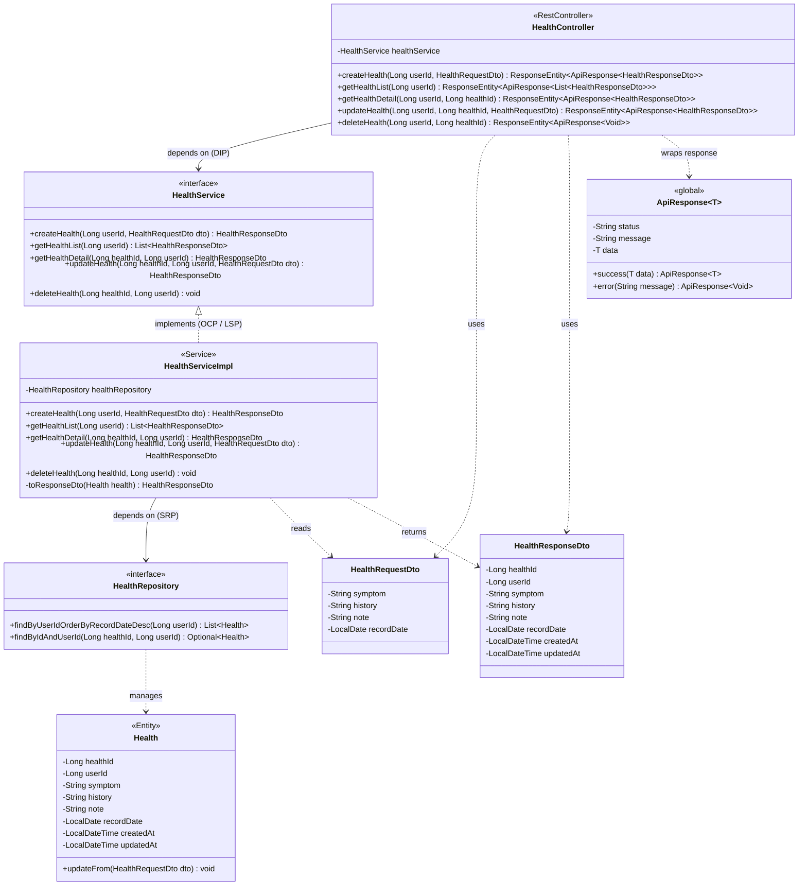

# Health 도메인 명세서

## 1. 프로젝트 목적

본 프로젝트는 **AI Doctor 서비스**로, 사용자의 건강 데이터와 처방 데이터를 기반으로 LLM이 건강 상태를 분석하고 질병 예측·식이·운동·주의사항을 추천하는 백엔드 시스템이다.

```
사용자 입력 (Health + Prescription)
        ↓
AiDatasetService → CSV 집계
        ↓
LLM 분석 (Claude / OpenAI)
        ↓
AiResult 저장 → health_status / summary_note / potential_diseases 등 반환
```

**Health 도메인의 역할**
- 사용자가 날짜별 증상(symptom), 병력(history), 메모(note)를 기록하는 **핵심 입력 데이터 소스**
- AI 파이프라인이 해당 데이터를 수집하여 분석에 사용

---

## 2. ERD – health 테이블

```
Table health {
  health_id   bigint   [pk, increment]
  user_id     bigint   [not null, ref: > users.user_id]
  symptom     text     [not null]
  history     text
  note        text
  record_date date     [not null]
  created_at  datetime [not null, default: `now()`]
  updated_at  datetime
}
```

| 컬럼 | 타입 | 설명 |
|------|------|------|
| health_id | bigint PK | 자동 증가 기본키 |
| user_id | bigint FK | users.user_id 참조 (N:1) |
| symptom | text NOT NULL | 주요 증상 (필수) |
| history | text | 과거 병력 (선택) |
| note | text | 추가 메모 (선택) |
| record_date | date NOT NULL | 증상 기록 날짜 |
| created_at | datetime | 생성 일시 (자동) |
| updated_at | datetime | 수정 일시 (자동) |

---

## 3. SOLID 설계 원칙

| 원칙 | 적용 내용 |
|------|----------|
| **S** Single Responsibility | `HealthController`는 HTTP 요청/응답만, `HealthServiceImpl`은 비즈니스 로직만, `HealthRepository`는 데이터 접근만 담당 |
| **O** Open/Closed | `HealthService`를 인터페이스로 선언하여 Controller를 수정하지 않고 구현체를 교체·확장 가능 |
| **L** Liskov Substitution | `HealthServiceImpl`은 `HealthService` 인터페이스의 모든 계약을 완전히 이행 |
| **I** Interface Segregation | `HealthService`는 health CRUD 메서드만 노출; AI CSV 수집은 `AiDatasetService`가 별도로 담당 |
| **D** Dependency Inversion | Controller는 구현체가 아닌 `HealthService` 인터페이스에 의존; Spring DI로 주입 |

---

## 4. 클래스 다이어그램



---

## 5. 패키지 구조

```
com.swe.backend.domain.health
├── controller
│   └── HealthController.java
├── service
│   ├── HealthService.java          (interface)
│   └── HealthServiceImpl.java
├── repository
│   └── HealthRepository.java       (extends JpaRepository<Health, Long>)
├── entity
│   └── Health.java
├── dto
│   ├── HealthRequestDto.java
│   └── HealthResponseDto.java
└── exception
    └── HealthNotFoundException.java
```

---

## 6. API 명세

### 공통
- **Base URL**: `/api/health`
- **인증**: JWT Access Token (Authorization: Bearer \<token\>)
- **응답 형식**: `ApiResponse<T>` `{ "status": "success"|"error", "message": "...", "data": ... }`

---

### 6-1. 건강 기록 생성

```
POST /api/health/create
```

**Request Body**
```json
{
  "symptom": "두통, 발열",
  "history": "고혈압 병력",
  "note": "어제부터 시작됨",
  "recordDate": "2026-05-01"
}
```

| 필드 | 타입 | 필수 | 설명 |
|------|------|------|------|
| symptom | String | Y | 주요 증상 |
| history | String | N | 과거 병력 |
| note | String | N | 추가 메모 |
| recordDate | LocalDate | Y | 증상 날짜 (yyyy-MM-dd) |

**Response `201 Created`**
```json
{
  "status": "success",
  "message": "건강 기록이 생성되었습니다.",
  "data": {
    "healthId": 1,
    "userId": 42,
    "symptom": "두통, 발열",
    "history": "고혈압 병력",
    "note": "어제부터 시작됨",
    "recordDate": "2026-05-01",
    "createdAt": "2026-05-01T10:00:00",
    "updatedAt": null
  }
}
```

**Error**
| 상태 코드 | 사유 |
|-----------|------|
| 400 | symptom 또는 recordDate 누락 |
| 401 | 인증 토큰 없음 또는 만료 |

---

### 6-2. 건강 기록 목록 조회

```
GET /api/health/list
```

**Response `200 OK`**
```json
{
  "status": "success",
  "message": "건강 기록 목록 조회 성공",
  "data": [
    {
      "healthId": 2,
      "userId": 42,
      "symptom": "기침",
      "history": null,
      "note": null,
      "recordDate": "2026-04-30",
      "createdAt": "2026-04-30T09:00:00",
      "updatedAt": null
    },
    {
      "healthId": 1,
      "userId": 42,
      "symptom": "두통, 발열",
      "history": "고혈압 병력",
      "note": "어제부터 시작됨",
      "recordDate": "2026-05-01",
      "createdAt": "2026-05-01T10:00:00",
      "updatedAt": null
    }
  ]
}
```

- 정렬: `record_date DESC`
- 본인 데이터만 반환

---

### 6-3. 건강 기록 단건 조회

```
GET /api/health/{healthId}
```

**Response `200 OK`**
```json
{
  "status": "success",
  "message": "건강 기록 조회 성공",
  "data": {
    "healthId": 1,
    "userId": 42,
    "symptom": "두통, 발열",
    "history": "고혈압 병력",
    "note": "어제부터 시작됨",
    "recordDate": "2026-05-01",
    "createdAt": "2026-05-01T10:00:00",
    "updatedAt": null
  }
}
```

**Error**
| 상태 코드 | 사유 |
|-----------|------|
| 404 | 존재하지 않는 기록 또는 타인 소유 |

---

### 6-4. 건강 기록 수정

```
PUT /api/health/update/{healthId}
```

**Request Body** *(변경할 필드만 포함 가능)*
```json
{
  "symptom": "두통 완화, 발열 지속",
  "history": "고혈압 병력",
  "note": "해열제 복용 후 호전",
  "recordDate": "2026-05-01"
}
```

**Response `200 OK`**
```json
{
  "status": "success",
  "message": "건강 기록이 수정되었습니다.",
  "data": {
    "healthId": 1,
    "userId": 42,
    "symptom": "두통 완화, 발열 지속",
    "history": "고혈압 병력",
    "note": "해열제 복용 후 호전",
    "recordDate": "2026-05-01",
    "createdAt": "2026-05-01T10:00:00",
    "updatedAt": "2026-05-01T14:30:00"
  }
}
```

**Error**
| 상태 코드 | 사유 |
|-----------|------|
| 400 | symptom 또는 recordDate 누락 |
| 404 | 존재하지 않는 기록 또는 타인 소유 |

---

### 6-5. 건강 기록 삭제

```
DELETE /api/health/delete/{healthId}
```

**Response `200 OK`**
```json
{
  "status": "success",
  "message": "건강 기록이 삭제되었습니다.",
  "data": null
}
```

**Error**
| 상태 코드 | 사유 |
|-----------|------|
| 404 | 존재하지 않는 기록 또는 타인 소유 |

---

## 7. 예외 처리

| 예외 클래스 | HTTP 상태 | 발생 조건 |
|-------------|-----------|----------|
| `HealthNotFoundException` | 404 | healthId가 존재하지 않거나 요청 userId와 불일치 (보안상 동일 처리) |
| `MethodArgumentNotValidException` | 400 | `@Valid` 검증 실패 (symptom·recordDate 누락) |
| `AccessDeniedException` | 401 | 인증 토큰 없음 또는 만료 |

> 모든 예외는 `GlobalExceptionHandler`(`@RestControllerAdvice`)에서 `ApiResponse` 형태로 통일 처리한다.

---

## 8. Repository 주요 쿼리

```java
// HealthRepository.java (extends JpaRepository<Health, Long>)

// 목록 조회 – 본인 데이터만, 최신 기록일 순
List<Health> findByUserIdOrderByRecordDateDesc(Long userId);

// 단건 조회 – 소유권 동시 검증
Optional<Health> findByIdAndUserId(Long healthId, Long userId);
```

---

## 9. AiDatasetService와의 연동

`AiDatasetService`는 `HealthRepository`에서 사용자의 건강 기록을 조회하여 다음 형태의 CSV로 변환한다.

```
record_date,symptom,history,note
2026-05-01,"두통, 발열","고혈압 병력","어제부터 시작됨"
2026-04-30,"기침",,
```

이 CSV는 LLM 프롬프트의 사용자 메시지에 삽입되어 `potential_diseases`, `recommended_foods`, `health_status` 등 분석 결과 생성에 사용된다.
